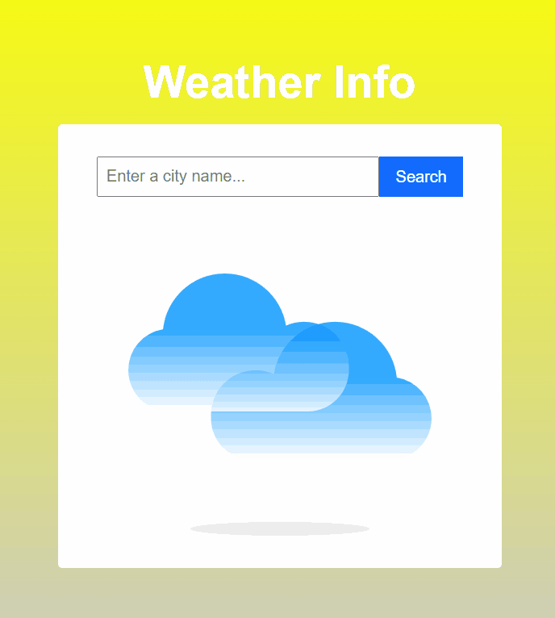

# weather-info

Weather info app created as a personal project.

# [🔗 View Deployed Application](https://hoang0211.github.io/weather-info/)

## Table Of Contents

- [Application Features](#Application-Features)
- [Technologies Used](#Technologies-Used)
- [Future Additions](#Future-Additions)

---

## Application Features

A weather info web application that allow users to find information about weather in different cities.

### Requirements

- Simple to use interface.
- Users can type a city name and find weather information about it.
- Auto focus applied, no need to use mouse.

[Back To Top](#Table-Of-Contents)

---

## Technologies Used

- React.js (Hooks)
- WeatherAPI
- GitHub Pages

[Back To Top](#Table-Of-Contents)

---

## Future Additions

[Back To Top](#Table-Of-Contents)
